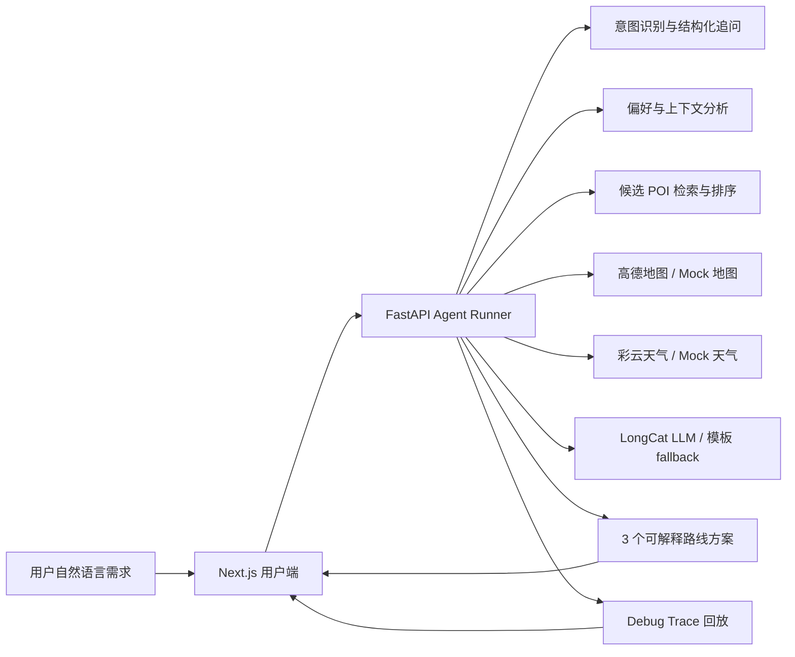

# 点仔 Ultra

> 把"附近有什么好吃好玩"，变成一条可以直接出发的路线。

**美团 2026 AI Hackathon 大赛 · 赛道 5：现在就出发 — AI 本地路线智能规划**

**团队：核心本地商业 | 作者：周鸿铭、王涵琪**

---

点仔 Ultra 是面向大众点评"点仔"的 AI 本地路线智能规划 Demo。它接住用户的一句话需求，理解场景、补齐约束、检索候选 POI，再结合地图距离、天气、排队、UGC 摘要和个人偏好，生成 3 个可解释、可微调、可直接执行的本地路线方案。

它不是一个只会聊天的助手。它要把“想去哪”推进到“怎么走、为什么这样走、哪里可能踩雷”。

## Demo

- Live Demo：Coming soon
- 当前状态：V3 最终接入阶段，本地 Demo 可运行
- 面向场景：大众点评本地生活、约会/亲子/朋友出游、临时决策、路线微调

## 一句话

用户说目标，点仔 Ultra 给路线。

不是搜索结果列表。

不是泛泛而谈的攻略。

而是一组能解释、能比较、能继续改的行动方案。

## 核心能力

**一句话生成路线**

用户不用先填表。系统会自动判断这是路线规划、方案微调、补全回答，还是普通 POI 问答。缺少关键信息时最多追问 2 轮，避免把轻量需求做成重表单。

**真实 provider 优先**

V3 主链路优先使用 LongCat LLM、高德地图 Web 服务 API、彩云天气 API。真实接口超时、失败、返回结构不合法或缺少 Key 时，系统才回退到 Mock 数据，也就是本地样例数据。

**Mock fallback 可解释**

回退不是偷偷发生的。Debug Trace 会写明触发原因、使用了哪些 Mock 数据、哪些字段可靠性是 `mocked`。

**Agent 全链路可回放**

这里的 Agent 可以理解为负责某个子任务的小助手。点仔 Ultra 把一次推荐拆成：识别意图、收集上下文、结构化追问、偏好分析、检索候选、地图距离、天气约束、排程、约束检查、生成方案、排序、微调。

右侧 Debug Trace 面板会展示每一步的输入、输出、耗时、provider 状态和 fallback 原因，让推荐结果有据可查。

**首屏干净**

Web 端首次进入不预置静态路线、不预置 Debug Trace、不预置 Mock 数据面板。只有用户真正提交需求后，当前 run 才出现。评委看到的是系统当下的处理过程，而不是提前写好的假日志。

**可解释，也可继续改**

默认返回 3 个方案，并给出推荐理由、路线节奏、适合人群、风险提示和可替换点位。用户可以继续说“太贵了”“换一个不用排队的”“我想多拍照”，系统会基于当前方案做局部微调。

## 截图

> 最终截图将在 Demo 部署后补充。

## 系统结构



## 技术栈

- 前端：Next.js App Router、TypeScript、Tailwind CSS、Motion for React、Swiper、Zustand、TanStack Query
- 后端：FastAPI、Python、Pydantic、provider adapter、可复现 deterministic fallback
- Provider：LongCat LLM、高德地图 Web 服务 API、彩云天气 API
- 本地数据：Mock User、Mock POI、UGC 摘要、排队预测、推荐菜、历史偏好
- 可解释性：Agent Trace、provider 状态、候选池、排除理由、排序依据、fallback 证据

## 本地运行

建议使用项目约定的 conda 环境：

```bash
conda run -n agent npm install
conda run -n agent npm run dev:api
conda run -n agent npm run dev:web
```

如果要接真实 provider，请复制示例环境变量文件并填入自己的 Key：

```bash
cp apps/api/.env.example .env
cp apps/web/.env.local.example apps/web/.env.local
```

`.env` 和 `.env.local` 已被 `.gitignore` 忽略，不应提交到公开仓库。

## 验证

```bash
conda run -n agent npm run lint:web
conda run -n agent npm run build:web
conda run -n agent npm run test:api
```

## 当前边界

- 地图、天气、LLM 已按真实 provider 优先设计；缺少 Key 或接口失败时会走 Mock fallback。
- 排队、UGC 摘要、推荐菜、用户历史行为等大众点评深度字段仍使用本地 Mock 或平台内 Mock 生成器。
- 公开仓库用于展示项目能力和代码设计；最终线上 Demo 链接会在部署完成后补充。
