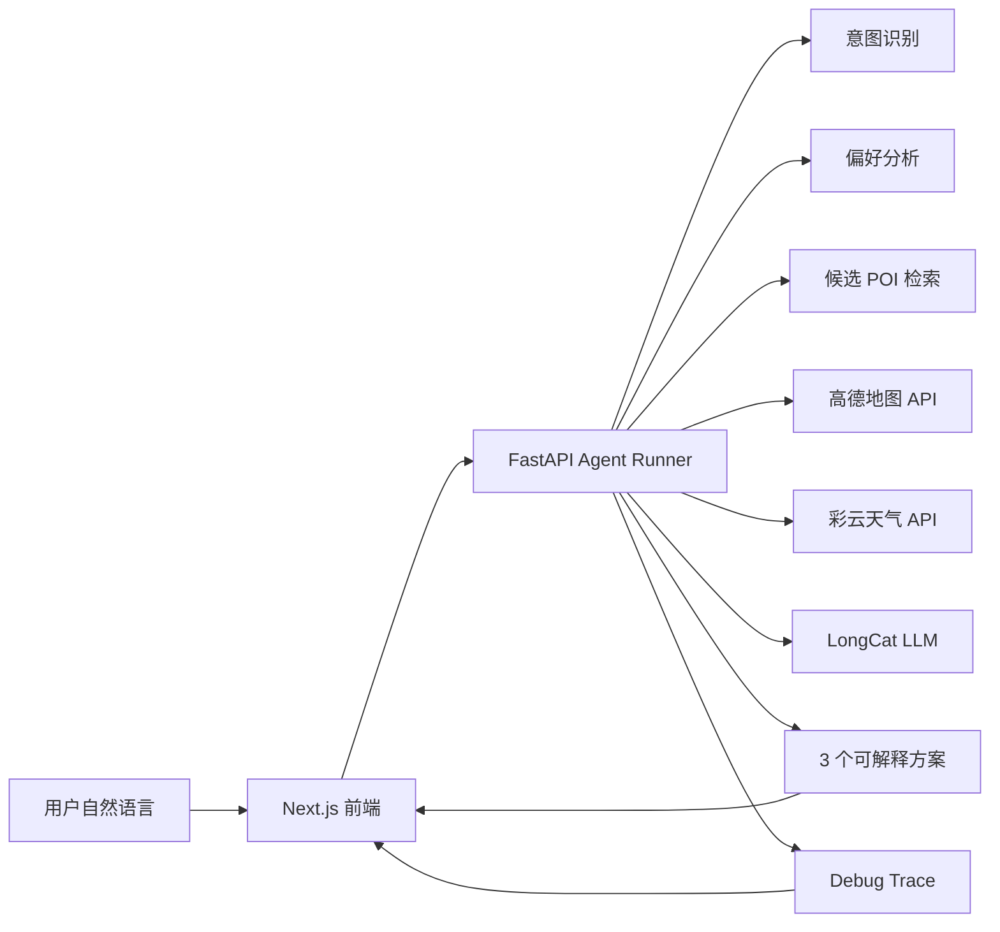

# 点仔 Ultra

<p align="center">
  <strong>把"附近有什么好吃好玩"，变成一条可以直接出发的路线。</strong>
</p>

<p align="center">
  美团 2026 AI Hackathon · 赛道 5：现在就出发 — AI 本地路线智能规划<br>
  周鸿铭 · 王涵琪
</p>

---

点仔 Ultra 是面向大众点评的 AI 本地路线智能规划系统。用户只需一句话，系统便会理解场景、补齐约束、检索候选 POI，结合实时地图距离、天气、排队热度与个人偏好，生成 **3 个可解释、可比较、可微调的本地路线方案**。

不是搜索结果列表，不是泛泛而谈的攻略——而是从"想去哪"到"怎么走、为什么这样走、哪里可能踩雷"的完整行动方案。

## Live Demo

**<https://dz-ultra-web.vercel.app>**

面向场景：大众点评本地生活 · 约会/亲子/朋友出游 · 临时决策 · 路线微调

## 产品展示

<table>
  <tr>
    <td align="center"><b>首页 · 大众点评沉浸式体验</b></td>
    <td align="center"><b>AI 首屏 · 一句话发起规划</b></td>
  </tr>
  <tr>
    <td></td>
    <td></td>
  </tr>
  <tr>
    <td align="center"><b>搜索屏 · 自然语言输入</b></td>
    <td align="center"><b>搜索屏 · AI 意图识别</b></td>
  </tr>
  <tr>
    <td></td>
    <td></td>
  </tr>
  <tr>
    <td align="center"><b>方案卡片 · 推荐理由一目了然</b></td>
    <td align="center"><b>全屏方案 · 路线节奏与替换建议</b></td>
  </tr>
  <tr>
    <td></td>
    <td></td>
  </tr>
</table>

## 核心能力

### 一句话生成路线

用户无需填表。系统自动判断意图类型——路线规划、方案微调、信息补全还是 POI 问答。缺少关键信息时最多追问 2 轮，轻量需求不会变成重表单。

### 真实服务优先

主链路优先调用 LongCat LLM、高德地图 Web 服务 API、彩云天气 API，确保推荐结果基于真实数据。当外部服务不可用时，系统自动降级至本地样例数据，并在 Debug Trace 中完整记录降级原因与影响范围——每一次降级都可追溯、可审计。

### Agent 全链路可回放

系统将一次推荐拆解为 12 个可追踪步骤：意图识别 → 上下文收集 → 结构化追问 → 偏好分析 → 候选检索 → 地图距离计算 → 天气约束 → 排程优化 → 约束检查 → 方案生成 → 排序 → 微调。Debug Trace 面板实时展示每一步的输入、输出、耗时与服务状态，让推荐结果有据可查。

### 首屏即真实

首次进入不预置任何静态路线或预设数据。只有用户真正提交需求后，系统才实时生成当前结果——所见即所得，没有任何提前编排的演示痕迹。

### 可解释，可微调

默认返回 3 个方案，每个方案附带推荐理由、路线节奏、适合人群、风险提示和可替换点位。用户可以继续说"太贵了""换一个不用排队的""我想多拍照"，系统基于当前方案做局部微调，而非从头重来。

## 系统架构



## 技术栈

| 层级 | 技术 |
|------|------|
| 前端 | Next.js App Router · TypeScript · Tailwind CSS · Motion · Swiper · Zustand · TanStack Query |
| 后端 | FastAPI · Python · Pydantic · Provider Adapter · Deterministic Fallback |
| AI / LLM | LongCat LLM |
| 地图 | 高德地图 Web 服务 API |
| 天气 | 彩云天气 API |
| 可解释性 | Agent Trace · 服务状态 · 候选池 · 排除理由 · 排序依据 · 降级证据 |

## 本地运行

```bash
# 安装依赖
npm install

# 启动后端
npm run dev:api

# 启动前端
npm run dev:web
```

如需接入真实地图与天气服务，请配置环境变量：

```bash
cp apps/api/.env.example apps/api/.env
cp apps/web/.env.local.example apps/web/.env.local
```

## 项目结构

```
├── apps/
│   ├── api/                  # FastAPI 后端
│   │   ├── app/agents/       # Agent 策略与执行引擎
│   │   ├── app/llm/          # LLM 服务接入
│   │   ├── app/maps/         # 高德地图服务接入
│   │   ├── app/weather/      # 彩云天气服务接入
│   │   ├── app/providers/    # 服务适配与降级策略
│   │   ├── app/models/       # 数据模型与 Schema
│   │   └── app/routers/      # API 路由
│   └── web/                  # Next.js 前端
│       ├── components/       # UI 组件
│       ├── stores/           # 状态管理
│       └── types/            # 类型定义
└── data/                     # 本地样例数据
```
