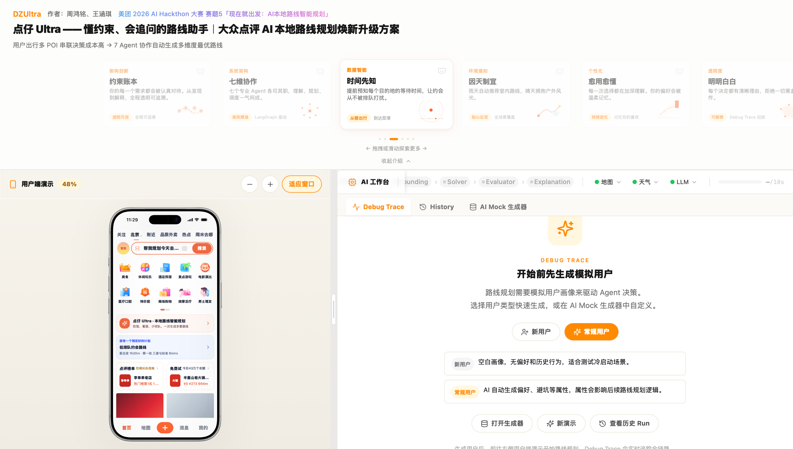
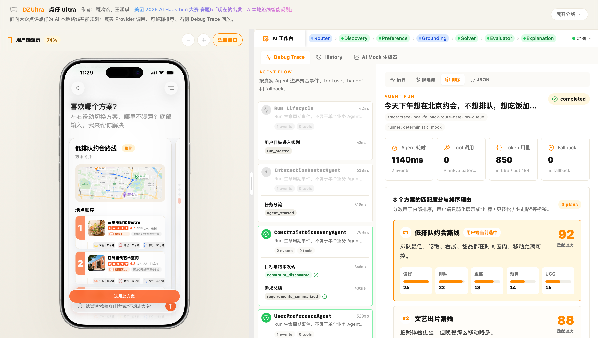
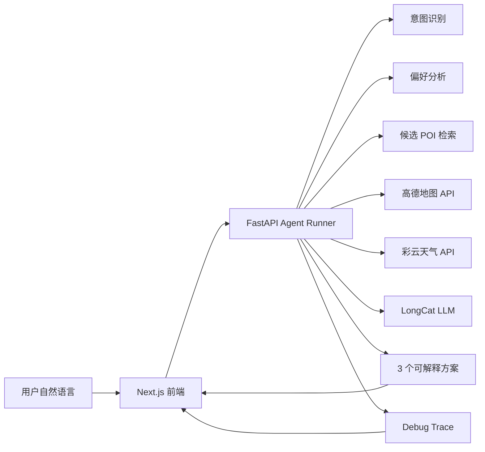

# 点仔 Ultra

<p align="center">
  <strong>把"附近有什么好吃好玩"，变成一条可以直接出发的路线。</strong>
</p>

<p align="center">
  美团 2026 AI Hackathon · 赛道 5：现在就出发 — AI 本地路线智能规划<br>
  周鸿铭 · 王涵琪
</p>

---

点仔 Ultra 是面向大众点评的 AI 本地路线智能规划系统。用户只需一句话，系统便会理解场景、补齐约束、检索候选 POI，结合实时地图距离、天气、排队热度与个人偏好，生成 **3 个可解释、可比较、可微调的本地路线方案**。

不是搜索结果列表，不是泛泛而谈的攻略——而是从"想去哪"到"怎么走、为什么这样走、哪里可能踩雷"的完整行动方案。

## Live Demo

**<https://dz-ultra-web.vercel.app>**

面向场景：大众点评本地生活 · 约会/亲子/朋友出游 · 临时决策 · 路线微调

## 产品展示

<table>
  <tr>
    <td align="center"><b>首页 · 大众点评沉浸式体验</b></td>
    <td align="center"><b>AI 首屏 · 一句话发起规划</b></td>
  </tr>
  <tr>
    <td></td>
    <td></td>
  </tr>
  <tr>
    <td align="center"><b>搜索屏 · 自然语言输入</b></td>
    <td align="center"><b>搜索屏 · AI 意图识别</b></td>
  </tr>
  <tr>
    <td></td>
    <td></td>
  </tr>
  <tr>
    <td align="center"><b>方案卡片 · 推荐理由一目了然</b></td>
    <td align="center"><b>全屏方案 · 路线节奏与替换建议</b></td>
  </tr>
  <tr>
    <td></td>
    <td></td>
  </tr>
</table>

## 核心能力

### 一句话生成路线

用户无需填表。系统自动判断意图类型——路线规划、方案微调、信息补全还是 POI 问答。缺少关键信息时最多追问 2 轮，轻量需求不会变成重表单。

### 真实服务优先

主链路优先调用 LongCat LLM、高德地图 Web 服务 API、彩云天气 API，确保推荐结果基于真实数据。当外部服务不可用时，系统自动降级至本地样例数据，并在 Debug Trace 中完整记录降级原因与影响范围——每一次降级都可追溯、可审计。

### Agent 全链路可回放

系统将一次推荐拆解为 12 个可追踪步骤：意图识别 → 上下文收集 → 结构化追问 → 偏好分析 → 候选检索 → 地图距离计算 → 天气约束 → 排程优化 → 约束检查 → 方案生成 → 排序 → 微调。Debug Trace 面板实时展示每一步的输入、输出、耗时与服务状态，让推荐结果有据可查。

### 首屏即真实

首次进入不预置任何静态路线或预设数据。只有用户真正提交需求后，系统才实时生成当前结果——所见即所得，没有任何提前编排的演示痕迹。

### 可解释，可微调

默认返回 3 个方案，每个方案附带推荐理由、路线节奏、适合人群、风险提示和可替换点位。用户可以继续说"太贵了""换一个不用排队的""我想多拍照"，系统基于当前方案做局部微调，而非从头重来。

## 系统架构



## 技术栈

| 层级 | 技术 |
|------|------|
| 前端 | Next.js App Router · TypeScript · Tailwind CSS · Motion · Swiper · Zustand · TanStack Query |
| 后端 | FastAPI · Python · Pydantic · Provider Adapter · Deterministic Fallback |
| AI / LLM | LongCat LLM |
| 地图 | 高德地图 Web 服务 API |
| 天气 | 彩云天气 API |
| 可解释性 | Agent Trace · 服务状态 · 候选池 · 排除理由 · 排序依据 · 降级证据 |

## 本地运行

```bash
# 安装依赖
npm install

# 启动后端
npm run dev:api

# 启动前端
npm run dev:web
```

如需接入真实地图与天气服务，请配置环境变量：

```bash
cp apps/api/.env.example apps/api/.env
cp apps/web/.env.local.example apps/web/.env.local
```

## 项目结构

```
├── apps/
│   ├── api/                  # FastAPI 后端
│   │   ├── app/agents/       # Agent 策略与执行引擎
│   │   ├── app/llm/          # LLM 服务接入
│   │   ├── app/maps/         # 高德地图服务接入
│   │   ├── app/weather/      # 彩云天气服务接入
│   │   ├── app/providers/    # 服务适配与降级策略
│   │   ├── app/models/       # 数据模型与 Schema
│   │   └── app/routers/      # API 路由
│   └── web/                  # Next.js 前端
│       ├── components/       # UI 组件
│       ├── stores/           # 状态管理
│       └── types/            # 类型定义
└── data/                     # 本地样例数据
```

---

## 系统字段设计

以下为 DZUltra 核心数据模型的字段说明，所有 POI 坐标、距离、天气等事实数据来自真实 Provider（高德地图、彩云天气），LLM 只负责理解和表达，不凭空生成事实。

### POI 数据（MockPoi）

POI（Point of Interest，兴趣点）是系统推荐的基本单元，对应大众点评上的一个商户或场所。

| 字段 | 类型 | 说明 | 数据来源 |
|------|------|------|---------|
| `id` | str | 唯一标识 | 高德 POI ID 或 Mock 生成 |
| `name` | str | 商户名称 | 高德 POI / Mock |
| `category` | PoiCategory | 类别（美食、甜品、咖啡、展览等） | 高德 POI / Mock |
| `city` / `district` / `area` | str | 城市/区/商圈 | 高德 POI |
| `latitude` / `longitude` | float | 地理坐标 | **高德地图 API（真实）** |
| `rating` | float | 评分（0-5） | 高德 POI / Mock |
| `review_count` | int | 评价数 | 高德 POI / Mock |
| `queue_minutes` | int | 预估排队时间（分钟） | Mock（大众点评深度字段） |
| `avg_price` | int | 人均消费（元） | 高德 POI / Mock |
| `open_hours` | str | 营业时间原文 | 高德 POI |
| `structured_open_hours` | StructuredOpenHours | 结构化营业时间 | 高德原文 + LLM 解析 |
| `visit_duration_minutes` | int | 建议停留时长 | Mock |
| `ugc_summary` | str | 用户评价摘要 | Mock（大众点评深度字段） |
| `recommended_dishes` | list[RecommendedDish] | 推荐菜/大家都在点 | Mock（大众点评深度字段） |
| `taste_rating` / `environment_rating` / `service_rating` | float | 口味/环境/服务分 | Mock（大众点评深度字段） |
| `booking_required` | bool | 是否需要预约 | Mock |
| `deal_summary` | str | 优惠信息 | Mock |
| `decision_signals` | dict | 决策信号（如"排队短"、"性价比高"） | Mock |
| `risk_notes` | list[str] | 风险提示 | Mock |
| `data_origin` | GeneratedDataOrigin | 数据来源标记 | 系统自动 |
| `data_reliability` | GeneratedDataReliability | 数据可靠性 | 系统自动 |

### 用户画像（MockUser）

| 字段 | 类型 | 说明 | 数据来源 |
|------|------|------|---------|
| `id` / `name` | str | 用户标识 | Mock |
| `scenario` | str | 使用场景（约会/亲子/朋友聚餐等） | Mock |
| `preferences` / `avoidances` | list[str] | 偏好/避雷标签 | Mock |
| `priority_weights` | dict | 偏好权重（如距离 0.3、排队 0.2） | Mock |
| `budget_per_person` | int | 人均预算 | Mock |
| `group_size` | int | 出行人数 | 用户输入 |
| `time_window` | str | 期望时间段 | 用户输入 |
| `saved_pois` / `viewed_pois` / `rated_pois` | list | 历史 POI 交互 | Mock |
| `history_summary` | str | 历史行为摘要 | Mock |

### 路线方案（RoutePlan）

| 字段 | 类型 | 说明 | 数据来源 |
|------|------|------|---------|
| `id` / `title` / `subtitle` | str | 方案标识和标题 | LLM 生成 / Mock |
| `score` | int | 综合评分（0-100） | 确定性评分规则 |
| `score_breakdown` | dict | 分维度评分（交通/排队/预算等） | 确定性评分规则 |
| `stops` | list[RouteStop] | 路线站点列表 | 排程 Agent |
| `transports` | list[TransportOption] | 交通方式选项 | **高德 route_matrix（真实）** |
| `transport_summary` | str | 交通概述 | LLM 生成 / Mock |
| `highlights` | list[str] | 方案亮点 | LLM 生成 / Mock |
| `map_points` | list[MapPoint] | 地图展示坐标 | **POI 真实坐标归一化** |
| `constraints` | list[RouteConstraint] | 约束满足情况 | 确定性规则检查 |
| `todo_items` | list[TodoItem] | 待办事项 | Mock |

### 路线站点（RouteStop）

| 字段 | 类型 | 说明 | 数据来源 |
|------|------|------|---------|
| `poi_id` / `poi_name` | str | 关联 POI | POI 数据 |
| `start_time` | str | 到达时间 | 排程计算 |
| `duration_minutes` | int | 停留时长 | POI visit_duration |
| `distance_from_previous` | str | 距上一站距离 | **高德 route_matrix（真实）** |
| `reason` | str | 推荐理由 | LLM 生成 |
| `actions` | list[PoiAction] | 可执行操作（导航/排队/团购等） | Mock |

### 交通选项（TransportOption）

| 字段 | 类型 | 说明 | 数据来源 |
|------|------|------|---------|
| `mode` | TransportMode | 交通方式（步行/打车/地铁） | — |
| `minutes` | int | 预计耗时 | **高德 route_matrix（真实）** |
| `cost` | str | 预计费用 | **基于真实距离估算** |
| `detail` | str | 补充说明 | 系统生成 |

### 地图距离矩阵（RouteMatrixLeg）

| 字段 | 类型 | 说明 | 数据来源 |
|------|------|------|---------|
| `origin_id` / `destination_id` | str | 起终点 POI ID | POI 数据 |
| `mode` | TransportMode | 交通方式 | 请求参数 |
| `distance_meters` | int | 距离（米） | **高德地图 API（真实）** |
| `duration_minutes` | int | 耗时（分钟） | **高德地图 API（真实）** |
| `polyline` | list[GeoCoordinate] | 路线折线坐标 | 高德地图 API |

### 天气数据

| 字段 | 类型 | 说明 | 数据来源 |
|------|------|------|---------|
| `temperature` | float | 当前温度 | **彩云天气 API（真实）** |
| `humidity` | float | 湿度 | **彩云天气 API（真实）** |
| `precipitation_probability` | float | 降水概率 | **彩云天气 API（真实）** |
| `hourly_forecast` | list | 逐小时预报 | **彩云天气 API（真实）** |
| `air_quality` | dict | 空气质量 | **彩云天气 API（真实）** |

### Debug Trace（TraceEvent）

| 字段 | 类型 | 说明 |
|------|------|------|
| `type` | TraceEventType | 事件类型（agent_step / provider_call / llm_chunk / constraint_check 等） |
| `label` | str | 步骤标签（如"约束发现"、"POI 检索"、"路线评分"） |
| `tool_name` | str | 使用的工具名称 |
| `duration_ms` | int | 步骤耗时 |
| `fallback_used` | bool | 是否触发了 fallback |
| `output` | dict | 步骤输出摘要 |
| `metadata` | dict | 包含 provider 调用详情、LLM 请求/响应、fallback 原因等 |

### 数据可靠性标记

每个数据字段都带有可靠性标记，用于 Debug Trace 区分真实数据和 Mock 数据：

| 标记 | 含义 |
|------|------|
| `verified` | 来自真实 Provider，已验证 |
| `generated_validated` | AI 生成但经过校验 |
| `mocked` | Mock 数据，仅供参考 |
| `unverified` | 未验证的数据 |

### Provider 调用链路

用户输入到方案输出的完整 Provider 调用链路：

```
用户输入
  → InteractionRouterAgent（LLM 分流）
  → ConstraintDiscoveryAgent（LLM 意图解析）
  → UserPreferenceAgent（Mock 用户画像）
  → ContextGroundingAgent
      → 高德 POI 搜索（真实）
      → 高德 route_matrix（真实距离/耗时）
      → 彩云天气（真实）
  → PlanSolverAgent（确定性排程 + 真实距离）
  → PlanEvaluatorAgent（确定性评分 + 真实交通评分）
  → PlanExplanationAgent（LLM 方案解释 + LLM 动态文案）
  → 输出 3 个可解释方案
```
